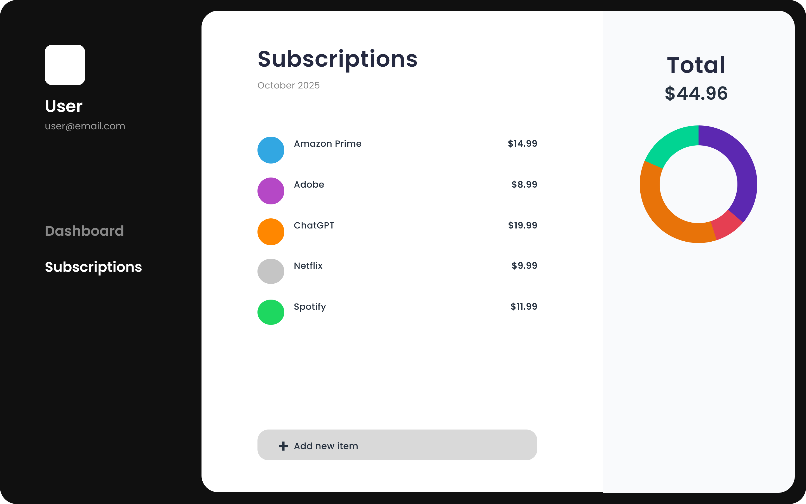

# Subscription Keeper
A subscription manager and splitter.
A user signs in and adds all of their personal subscriptions (Netflix, Spotify, YouTube, Microsoft 365 Family, Amazon) with cost and renewal information. For shared subscriptions, the user can add assign friends. It will calculate each participant’s share of the cost. There is going to be a dashboard with upcoming renewals, total monthly spending, and outstanding balances. The user can send notifications to friends to reimburse their share. The product gives users a single, organized view of their digital expenses and an easy way to track and split costs.


# How to run
Provide here instructions on how to use your application.   
- Download the latest binary from the Release section on the right on GitHub.  
- On the command line uncompress using

- Set up virtual environment.
```
 python -m venv .venv
 source .venv/bin/activate 
 pip install -r requirements.txt
```

```
python -m uvicorn test:app --reload --port 8000
```
- Go to http://127.0.0.1:8000/subscriptions. You will see subscriptions in JSON. 

# How to contribute
Follow this project board to know the latest status of the project: [http://...]([http://...])  

### How to build
- Use this github repository: ... 
- Specify what branch to use for a more stable release or for cutting edge development.  
- Use InteliJ 11
- Specify additional library to download if needed 
- What file and target to compile and run. 
- What is expected to happen when the app start. 
