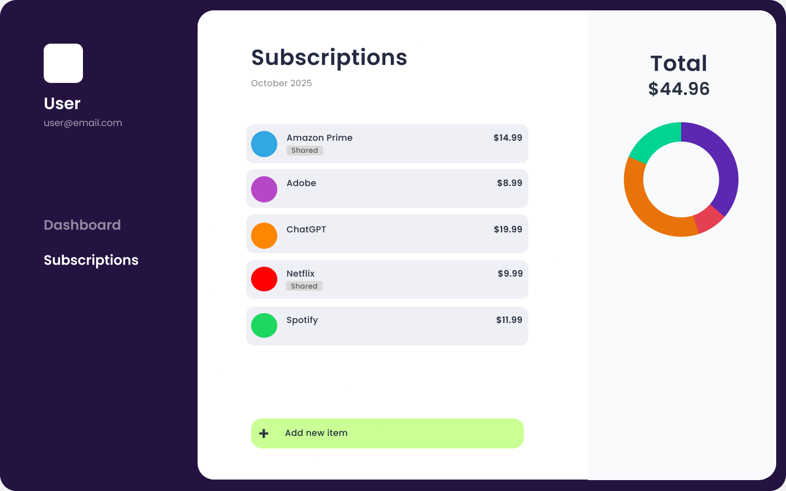

# Subscription Keeper
A subscription manager and splitter.
A user signs in and adds all of their personal subscriptions (Netflix, Spotify, YouTube, Microsoft 365 Family, Amazon) with cost and renewal information. For shared subscriptions, the user can add assign friends. It will calculate each participant’s share of the cost. There is going to be a dashboard with upcoming renewals, total monthly spending, and outstanding balances. The user can send notifications to friends to reimburse their share. The product gives users a single, organized view of their digital expenses and an easy way to track and split costs.


# How to run
- Set up virtual environment.
```
 python -m venv .venv
 source .venv/bin/activate 
 pip install -r requirements.txt
```

# Proof Of Concept
run this to test endpoints
```
python -m uvicorn proofOfConcept:app --reload --port 8000
```
Go to http://127.0.0.1:8000/subscriptions. You will see subscriptions in JSON.
- [{"id":1,"name":"Netflix","cost":15.99,"shared":true},{"id":2,"name":"Spotify","cost":11.99,"shared":false}]

Initialize firebase
  generate token
  ```
  python get_token.py 
  ```
  Initialize Firebase Admin
  ```
  uvicorn initFirebase:app --reload
  ```
  make request with generated token:
  ```
  curl -H "Authorization: Bearer <TOKEN>" http://127.0.0.1:8000/protected
  ```
  this will result in {"message":"Welcome, test@gmail.com! Your UID is __."}. Allows to sign-in through Firebase.
